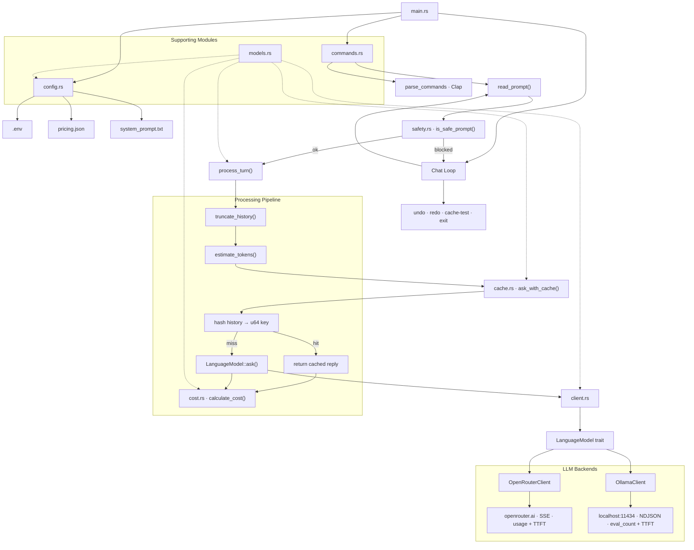

# llm-cli

A modular command-line LLM client written in Rust, backed by either the [OpenRouter](https://openrouter.ai) API or a local [Ollama](https://ollama.com) instance.

## Architecture



## Modules

| File | Responsibility |
|---|---|
| `main.rs` | Entry point, chat loop, undo/redo stack, `process_turn<M>` |
| `commands.rs` | Clap CLI definition, stdin reader |
| `client.rs` | `LanguageModel` trait + `OpenRouterClient` |
| `ollama.rs` | `OllamaClient` implementing `LanguageModel` |
| `cache.rs` | In-memory response cache keyed by conversation hash |
| `cost.rs` | Cost estimation from token counts or provider usage |
| `history.rs` | Token estimation (`len/4`) + history truncation |
| `safety.rs` | Prompt-injection guardrail (banned phrase list) |
| `config.rs` | Loads `.env`, `pricing.json`, `system_prompt.txt` |
| `models.rs` | Shared data types: `Message`, `Usage`, `Pricing`, streaming types |

## Setup

### OpenRouter

Create a `.env` file:

```
OPENROUTER_API_KEY=your_key_here
```

Configure `pricing.json` with your model's pricing:

```json
{
  "model": "anthropic/claude-3-haiku",
  "input_per_million": 0.25,
  "output_per_million": 1.25
}
```

### Ollama

Install [Ollama](https://ollama.com) and pull a model:

```bash
ollama pull llama3.2
```

Ollama runs locally on `http://localhost:11434` — no API key needed.

## Usage

```bash
cargo run -- ask "what is ownership in rust?"
```

### Interactive chat loop

```bash
cargo run -- ask
You: hello
AI: Hi! How can I help you today?
You: undo
undid last turn
History: [...]
You: redo
REdid last turn.
History: [...]
You: cache-test
Cache test: first call
Cache test: second call
Same response? true
You: exit
```

### Overriding the model

```bash
cargo run -- ask --model llama3.2 "explain borrows"
```

The `--model` flag overrides the model in `pricing.json`.

### System prompt

```bash
cargo run -- ask --system-prompt custom_prompt.txt
```

Default: `system_prompt.txt` in the project root.

## Commands

| Command | Description |
|---|---|
| `ask <text>` | Single-shot request, exits immediately |
| `ask` | Interactive chat loop |
| `undo` | Remove the last user/assistant turn pair |
| `redo` | Restore the most recently undone turn |
| `cache-test` | Verify cache hits return identical responses |
| `exit` | End the session |

## Features

- **Pluggable backends** — swap `OpenRouterClient` and `OllamaClient` via the `LanguageModel` trait without changing any other code
- **Response caching** — cache by conversation hash; identical repeated prompts are instant
- **Cost tracking** — uses provider-reported token counts when available, falls back to character estimation
- **History truncation** — oldest user/assistant pairs dropped when token budget is exceeded
- **Prompt injection guard** — blocks common jailbreak phrases; keeps the loop running without crashing
- **Undo / redo** — in-memory stack; survives truncation but not restarts
- **Performance metrics** — TTFT and tokens/second printed after each response
- **Streaming output** — tokens arrive in real-time via SSE (OpenRouter) or NDJSON (Ollama)

## Layout

```
llm-cli/
├── Cargo.toml
├── pricing.json         # model + $/million tokens
├── system_prompt.txt    # system prompt
├── custom_prompt.txt    # optional alternative
├── .env                 # OPENROUTER_API_KEY (not committed)
└── src/
    ├── main.rs
    ├── client.rs        # LanguageModel trait + OpenRouterClient
    ├── ollama.rs        # OllamaClient
    ├── cache.rs         # ask_with_cache<M>()
    ├── cost.rs          # estimate / calculate cost
    ├── history.rs       # token estimate + truncate
    ├── safety.rs        # prompt injection guardrail
    ├── config.rs        # env, pricing, system prompt
    ├── commands.rs      # clap CLI
    └── models.rs        # shared types
```