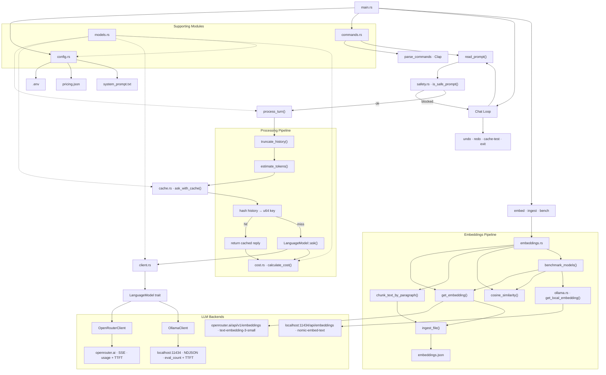

# llm-cli

A modular command-line LLM client written in Rust, backed by either the [OpenRouter](https://openrouter.ai) API or a local [Ollama](https://ollama.com) instance.

Alongside the chat client it ships an embeddings toolkit: generate a vector for a string, ingest a text file into paragraph chunks, and benchmark remote versus local embedding models by cosine similarity.

## Architecture



## Modules

| File | Responsibility |
|---|---|
| `main.rs` | Entry point, chat loop, undo/redo stack, `process_turn<M>` |
| `commands.rs` | Clap CLI definition, stdin reader |
| `client.rs` | `LanguageModel` trait + `OpenRouterClient` |
| `ollama.rs` | `OllamaClient` implementing `LanguageModel`, plus `get_local_embedding()` |
| `embeddings.rs` | Embedding generation, paragraph chunking, file ingestion, cosine similarity, model benchmarking |
| `cache.rs` | In-memory response cache keyed by conversation hash |
| `cost.rs` | Cost estimation from token counts or provider usage |
| `history.rs` | Token estimation (`len/4`) + history truncation |
| `safety.rs` | Prompt-injection guardrail (banned phrase list) |
| `config.rs` | Loads `.env`, `pricing.json`, `system_prompt.txt` |
| `models.rs` | Shared data types: `Message`, `Usage`, `Pricing`, streaming types |

## Setup

### OpenRouter

Create a `.env` file:

```
OPENROUTER_API_KEY=your_key_here
```

Configure `pricing.json` with your model's pricing:

```json
{
  "model": "anthropic/claude-3-haiku",
  "input_per_million": 0.25,
  "output_per_million": 1.25
}
```

### Ollama

Install [Ollama](https://ollama.com), which runs locally on `http://localhost:11434` and needs no API key.

`bench` embeds through a local model, so pull it first:

```bash
ollama pull nomic-embed-text
```

Chatting through Ollama is implemented (`OllamaClient` in `ollama.rs`) but not wired to a flag — `main()` constructs `OpenRouterClient`, so switching backends means changing that one line. Pull a chat model when you do:

```bash
ollama pull llama3.2
```

### Shared startup requirements

`main()` loads `.env`, `pricing.json`, and the system prompt before dispatching any subcommand, so `embed`, `ingest`, and `bench` still require `OPENROUTER_API_KEY` plus both files to be present even though they never send a chat request.

## Usage

```bash
cargo run -- ask "what is ownership in rust?"
```

### Interactive chat loop

`ask` always takes an opening prompt, sends it, then stays in the loop until you type `exit`:

```bash
cargo run -- ask "hello"
```

```
🌐 [CACHE MISS] calling API

Hi! How can I help you today?
⏱️  Performance Metrics (API - OpenRouter):
  Time to first token:  …
  Tokens generated:     …
  Tokens per second:    … tok/s
  Total time:           …


Complete response:
Hi! How can I help you today?
pricing model: x-ai/grok-4.5
cost source: provider usage
You: undo
undid last turn

-------History--------
[0] system: You are a helpful Rust programming assistant. …

----------------------------

You: redo
REdid last turn.

-------History--------
[0] system: …
[1] user: hello
[2] assistant: Hi! How can I help you today?

----------------------------

You: cache-test
Cache test: first call

🌐 [CACHE MISS] calling API

Cache test: second call

⚡ [CACHE HIT] serving from memory

Cache test complete.
Same response? true
Second reply: …
You: exit
```

Tokens stream in as they arrive, so each reply appears once live and again under `Complete response:`.

### Overriding the model

```bash
cargo run -- ask --model anthropic/claude-3-haiku "explain borrows"
```

The `--model` (`-m`) flag overrides the model in `pricing.json` for that run. `main()` constructs `OpenRouterClient`, so the value must be an OpenRouter model ID.

### System prompt

`--system-prompt` is a top-level flag and must come *before* the subcommand:

```bash
cargo run -- --system-prompt custom_prompt.txt ask "explain borrows"
```

Default: `system_prompt.txt` in the project root. Passing it after the subcommand (`ask --system-prompt …`) is rejected by clap.

## Embeddings

### Generate a single vector

```bash
cargo run -- embed "what is a vector?"
```

Calls OpenRouter's embeddings endpoint with `openai/text-embedding-3-small` and prints the vector's dimension count (1536) followed by a preview of the first five values.

### Ingest a file

```bash
cargo run -- ingest test_notes.txt
cargo run -- ingest test_notes.txt --output notes.json
```

Splits the file on blank lines, embeds each paragraph, and writes the results to `embeddings.json` by default (`-o` / `--output` to override):

```
🚀 Starting ingestion of file: test_notes.txt
Reading file: test_notes.txt
Split into 3 chunks.
🧠 [1/3] Generating embedding...
🧠 [2/3] Generating embedding...
🧠 [3/3] Generating embedding...
✅ Saved 3 embeddings to embeddings.json
```

Each entry pairs the chunk text with its 1536-float vector:

```json
[
  {
    "data": "Rust is a multi-paradigm, general-purpose programming language...",
    "vector": [-0.0070724487, 0.03201294, ...]
  }
]
```

The stored type is `Embedding<T>`, generic over its payload. `ingest_file` uses `Embedding<String>`, but `T` can be any serializable struct — `Document { title, body }` is included as an example.

### Benchmark remote vs local

```bash
cargo run -- bench
```

Ranks three built-in sample documents against the query `"How to fix a flat tire"` twice — once with OpenRouter's `text-embedding-3-small`, once with local Ollama `nomic-embed-text` — then prints both rankings with cosine-similarity scores, highest first. Requires a running Ollama instance.

Scoring uses `cosine_similarity()`, which returns `0.0` for mismatched-length or zero-magnitude vectors rather than producing `NaN`.

## Commands

### Subcommands

| Subcommand | Description |
|---|---|
| `ask <prompt>` | Send the opening turn, then stay in the interactive chat loop |
| `ask <prompt> -m <model>` | Same, overriding the model from `pricing.json` |
| `embed <text>` | Print the embedding's dimension count and a preview of its first 5 values |
| `ingest <file>` | Chunk a file by paragraph, embed each chunk, write JSON |
| `ingest <file> -o <path>` | Same, writing somewhere other than the default `embeddings.json` |
| `bench` | Rank sample documents against a fixed query using both OpenRouter and local Ollama embeddings |

Global flag: `--system-prompt <path>`, default `system_prompt.txt`. It belongs to the top-level command, so it must precede the subcommand.

### In-loop commands

Typed at the `You:` prompt inside `ask`:

| Command | Description |
|---|---|
| `undo` | Remove the last user/assistant turn pair, then print history |
| `redo` | Restore the most recently undone turn, then print history |
| `cache-test` | Verify cache hits return identical responses |
| `exit` | End the session |

Anything else is sent to the model as the next turn — after passing the injection guardrail — and clears the redo stack.

## Features

- **Pluggable backends** — swap `OpenRouterClient` and `OllamaClient` via the `LanguageModel` trait by changing the single construction site in `main()`
- **Response caching** — cache by conversation hash; identical repeated prompts are instant
- **Cost tracking** — uses provider-reported token counts when available, falls back to character estimation
- **History truncation** — oldest user/assistant pairs dropped when token budget is exceeded
- **Prompt injection guard** — blocks common jailbreak phrases; keeps the loop running without crashing
- **Undo / redo** — in-memory stack; survives truncation but not restarts
- **Performance metrics** — TTFT and tokens/second printed after each response
- **Streaming output** — tokens arrive in real-time via SSE (OpenRouter) or NDJSON (Ollama)
- **Embedding generation** — `openai/text-embedding-3-small` through OpenRouter, reusing the existing `OPENROUTER_API_KEY`
- **File ingestion** — splits on blank lines and writes a JSON index of `{ data, vector }` pairs
- **Generic payloads** — `Embedding<T>` holds any serializable type, not just plain chunk strings
- **Cosine similarity** — `NaN`-safe scoring that returns `0.0` on mismatched or zero-magnitude vectors
- **Remote vs local benchmarking** — `bench` ranks the same documents with OpenRouter and Ollama `nomic-embed-text` side by side

## Testing

```bash
cargo test
```

18 unit tests covering token estimation and truncation (`history`), cost calculation (`cost`), the injection guardrail (`safety`), cache hits with a mock client (`cache`), and cosine similarity plus the generic `Embedding<T>` (`embeddings`).

## Layout

```
llm-cli/
├── Cargo.toml
├── pricing.json         # model + $/million tokens
├── system_prompt.txt    # system prompt
├── custom_prompt.txt    # optional alternative
├── test_notes.txt       # sample input for `ingest`
├── embeddings.json      # generated by `ingest`
├── .env                 # OPENROUTER_API_KEY (not committed)
└── src/
    ├── main.rs
    ├── client.rs        # LanguageModel trait + OpenRouterClient
    ├── ollama.rs        # OllamaClient + get_local_embedding()
    ├── embeddings.rs    # embed, chunk, ingest, cosine similarity, bench
    ├── cache.rs         # ask_with_cache<M>()
    ├── cost.rs          # estimate / calculate cost
    ├── history.rs       # token estimate + truncate
    ├── safety.rs        # prompt injection guardrail
    ├── config.rs        # env, pricing, system prompt
    ├── commands.rs      # clap CLI
    └── models.rs        # shared types
```