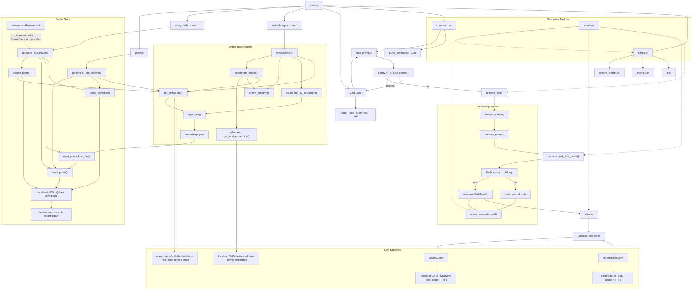

# llm-cli

A modular command-line LLM client written in Rust, backed by either the [OpenRouter](https://openrouter.ai) API or a local [Ollama](https://ollama.com) instance.

Alongside the chat client it ships a retrieval toolkit: generate a vector for a string, ingest a text file into paragraph chunks, benchmark remote versus local embedding models by cosine similarity, persist the results to a [Qdrant](https://qdrant.tech) vector store running in Docker, and query that store by semantic similarity. `pipeline` runs read → chunk → embed → index as a single command.

## Architecture



## Modules

| File | Responsibility |
|---|---|
| `main.rs` | Entry point, chat loop, undo/redo stack, `process_turn<M>` |
| `commands.rs` | Clap CLI definition, stdin reader |
| `client.rs` | `LanguageModel` trait + `OpenRouterClient` |
| `ollama.rs` | `OllamaClient` implementing `LanguageModel`, plus `get_local_embedding()` |
| `embeddings.rs` | Embedding generation, paragraph chunking, file ingestion, cosine similarity, model benchmarking |
| `qdrant.rs` | `QdrantClient` REST wrapper: `create_collection()`, `insert_points()`, `insert_points_from_file()`, plus the free `search_points()` |
| `retriever.rs` | Backend-agnostic `Retriever` trait and `RetrievalResult`, implemented for `QdrantClient` |
| `pipeline.rs` | `run_pipeline()` — read, chunk, embed, create the collection, and index in one pass |
| `cache.rs` | In-memory response cache keyed by conversation hash |
| `cost.rs` | Cost estimation from token counts or provider usage |
| `history.rs` | Token estimation (`len/4`) + history truncation |
| `safety.rs` | Prompt-injection guardrail (banned phrase list) |
| `config.rs` | Loads `.env`, `pricing.json`, `system_prompt.txt` |
| `models.rs` | Shared data types: `Message`, `Usage`, `Pricing`, streaming types |

## Setup

### OpenRouter

Create a `.env` file:

```
OPENROUTER_API_KEY=your_key_here
```

Configure `pricing.json` with your model's pricing:

```json
{
  "model": "anthropic/claude-3-haiku",
  "input_per_million": 0.25,
  "output_per_million": 1.25
}
```

### Ollama

Install [Ollama](https://ollama.com), which runs locally on `http://localhost:11434` and needs no API key.

`bench` embeds through a local model, so pull it first:

```bash
ollama pull nomic-embed-text
```

Chatting through Ollama is implemented (`OllamaClient` in `ollama.rs`) but not wired to a flag — `main()` constructs `OpenRouterClient`, so switching backends means changing that one line. Pull a chat model when you do:

```bash
ollama pull llama3.2
```

### Qdrant

`setup`, `index`, `search`, and `pipeline` talk to Qdrant's REST API on `http://localhost:6333`. `docker-compose.yml` defines the server:

```bash
docker compose up -d
```

| Setting | Value |
|---|---|
| Image | `qdrant/qdrant:latest` |
| Container name | `mango-qdrant` |
| Ports | `6333` (REST), `6334` (gRPC) |
| Volume | `qdrant_storage` → `/qdrant/storage`, so indexed points survive restarts |
| Restart policy | `unless-stopped` |

`docker compose stop` halts it. `docker compose down` removes the container but keeps the named volume — add `-v` to delete the indexed points as well.

> **Note:** `container_name` is pinned to `mango-qdrant`, so only one copy of this stack can run at a time. If a `mango-qdrant` container already exists — for example started from another checkout of the same compose file — `docker compose up -d` here fails with a name conflict. Volumes are also project-scoped (`<project>_qdrant_storage`), so a second project starts with an empty database instead of seeing the first one's collections.

### Shared startup requirements

`main()` loads `.env`, `pricing.json`, and the system prompt before dispatching any subcommand, so `embed`, `ingest`, `bench`, `setup`, `index`, `search`, and `pipeline` all still require `OPENROUTER_API_KEY` plus both files to be present even though they never send a chat request. `setup`, `index`, `search`, and `pipeline` additionally need Qdrant reachable on port `6333`.

## Usage

```bash
cargo run -- ask "what is ownership in rust?"
```

### Interactive chat loop

`ask` always takes an opening prompt, sends it, then stays in the loop until you type `exit`:

```bash
cargo run -- ask "hello"
```

```
🌐 [CACHE MISS] calling API

Hi! How can I help you today?
⏱️  Performance Metrics (API - OpenRouter):
  Time to first token:  …
  Tokens generated:     …
  Tokens per second:    … tok/s
  Total time:           …


Complete response:
Hi! How can I help you today?
pricing model: x-ai/grok-4.5
cost source: provider usage
You: undo
undid last turn

-------History--------
[0] system: You are a helpful Rust programming assistant. …

----------------------------

You: redo
REdid last turn.

-------History--------
[0] system: …
[1] user: hello
[2] assistant: Hi! How can I help you today?

----------------------------

You: cache-test
Cache test: first call

🌐 [CACHE MISS] calling API

Cache test: second call

⚡ [CACHE HIT] serving from memory

Cache test complete.
Same response? true
Second reply: …
You: exit
```

Tokens stream in as they arrive, so each reply appears once live and again under `Complete response:`.

### Overriding the model

```bash
cargo run -- ask --model anthropic/claude-3-haiku "explain borrows"
```

The `--model` (`-m`) flag overrides the model in `pricing.json` for that run. `main()` constructs `OpenRouterClient`, so the value must be an OpenRouter model ID.

### System prompt

`--system-prompt` is a top-level flag and must come *before* the subcommand:

```bash
cargo run -- --system-prompt custom_prompt.txt ask "explain borrows"
```

Default: `system_prompt.txt` in the project root. Passing it after the subcommand (`ask --system-prompt …`) is rejected by clap.

## Embeddings

### Generate a single vector

```bash
cargo run -- embed "what is a vector?"
```

Calls OpenRouter's embeddings endpoint with `openai/text-embedding-3-small` and prints the vector's dimension count (1536) followed by a preview of the first five values.

### Ingest a file

```bash
cargo run -- ingest test_notes.txt
cargo run -- ingest test_notes.txt --output notes.json
```

Splits the file on blank lines, embeds each paragraph, and writes the results to `embeddings.json` by default (`-o` / `--output` to override):

```
🚀 Starting ingestion of file: test_notes.txt
Reading file: test_notes.txt
Split into 3 chunks.
🧠 [1/3] Generating embedding...
🧠 [2/3] Generating embedding...
🧠 [3/3] Generating embedding...
✅ Saved 3 embeddings to embeddings.json
```

Each entry pairs the chunk text with its 1536-float vector:

```json
[
  {
    "data": "Rust is a multi-paradigm, general-purpose programming language...",
    "vector": [-0.0070724487, 0.03201294, ...]
  }
]
```

The stored type is `Embedding<T>`, generic over its payload. `ingest_file` uses `Embedding<String>`, but `T` can be any serializable struct — `Document { title, body }` is included as an example.

### Benchmark remote vs local

```bash
cargo run -- bench
```

Ranks three built-in sample documents against the query `"How to fix a flat tire"` twice — once with OpenRouter's `text-embedding-3-small`, once with local Ollama `nomic-embed-text` — then prints both rankings with cosine-similarity scores, highest first. Requires a running Ollama instance.

Scoring uses `cosine_similarity()`, which returns `0.0` for mismatched-length or zero-magnitude vectors rather than producing `NaN`.

## Vector store

`ingest` leaves embeddings in a JSON file. `setup` and `index` push them into Qdrant, where they persist across runs, and `search` queries them back:

```
ingest <file>  →  embeddings.json  →  index  →  Qdrant collection  →  search <query>
                     setup <name> creates the collection first

pipeline <file>  →  chunk → embed → create collection → index    (all of the above, no JSON file)
```

Every Qdrant call goes through `QdrantClient`, a thin struct holding the `base_url` (`http://localhost:6333`, hardcoded in `QdrantClient::new()`).

### 1. Create a collection

```bash
cargo run -- setup my_notes
```

```
🚀 Setting up Qdrant collection: my_notes
✅ Collection 'my_notes' ready.
```

`create_collection()` issues `PUT /collections/{name}` with `{"vectors": {"size": 1536, "distance": "Cosine"}}`. The size is hardcoded to **1536** at the call site in `main.rs` to match `text-embedding-3-small`; indexing vectors from a different embedding model means changing that value.

The call is idempotent: a `409 Conflict` from an existing collection is treated as success alongside `200`/`201`, so re-running `setup` (or letting `pipeline` create the collection every run) is safe. Any other status is returned as an error.

### 2. Index the embeddings

```bash
cargo run -- index
cargo run -- index --file notes.json
```

```
✅ Indexed 3 points into 'my_notes'.
```

`insert_points_from_file()` reads `embeddings.json` by default (`-f` / `--file` to override), expects the `{ data, vector }` shape that `ingest` writes, and hands the pairs to `insert_points()`. Each entry becomes one point:

```json
{ "id": 1, "vector": [-0.0070724487, 0.03201294, ...], "payload": { "text": "Rust is a multi-paradigm..." } }
```

Two behaviours worth knowing:

- The target collection is **hardcoded to `my_notes`** in `main.rs`. `index` ignores whatever name you gave `setup`, so the default path only works if you ran `cargo run -- setup my_notes`.
- IDs are the 1-based position of the chunk in the file, and `PUT /collections/{name}/points` upserts. Indexing a different file into the same collection silently overwrites the points whose IDs collide.

### 3. Search the collection

```bash
cargo run -- search "how does ownership work?"
cargo run -- search "ownership" --limit 5
cargo run -- search "ownership" --keyword rust
```

```
Searching for: "how does ownership work?"
Query embedded (1536 dimensions)

Top 3 results:

  1. [Score: 0.424]
     Rust's ownership system ensures memory safety without a garbage collector. Each value has one owner, and when the owner goes out of scope, the value is dropped.

  2. [Score: 0.210]
     CAP theorem states that a distributed system cannot simultaneously guarantee consistency, availability, and partition tolerance under a network partition. …

  3. [Score: 0.189]
     A process is an independent running program with its own memory space. …
```

The query is embedded with the same `openai/text-embedding-3-small` model used for indexing, then posted to `POST /collections/{name}/points/search` with `with_payload: true`. Results come back sorted by cosine score, highest first.

| Flag | Default | Effect |
|---|---|---|
| `-l` / `--limit` | `3` | How many points to return |
| `-k` / `--keyword` | none | Adds a Qdrant payload filter on the `text` field |

`--keyword` attaches a `must` / `match` full-text condition, so only chunks containing that word are scored at all. Matching is case-insensitive, and it works without declaring a payload index — Qdrant falls back to scanning when the field is unindexed. On a large collection, add a full-text index on `text` to keep filtered queries fast.

Two things to know about the current wiring:

- Like `index`, the collection is **hardcoded to `my_notes`** in `main.rs`. Searching a collection you created under another name is not reachable from the CLI yet.
- `retriever.rs` defines a backend-agnostic `Retriever` trait and implements it for `QdrantClient`, but the `search` arm calls the free `qdrant::search_points()` directly. The boxed trait object is constructed and dropped unused (`warning: unused variable: retriever`), so the abstraction is in place but not yet on the call path.

### One command for the whole path: `pipeline`

```bash
cargo run -- pipeline test_notes.txt
cargo run -- pipeline test_notes.txt --collection my_docs
```

```
Reading file: test_notes.txt
Found 3 chunks to embed.
  Embedding chunk 1/3...
  Embedding chunk 2/3...
  Embedding chunk 3/3...
📦 Setting up Qdrant collection: my_notes
✅ Collection 'my_notes' ready.
🚀 Indexing 3 points into Qdrant...
✅ Indexed 3 points into 'my_notes'.
✅ Pipeline complete! 3 chunks are now searchable.

Done! 3 chunks indexed into 'my_notes'.
   Try: cargo run -- search "your question here"
```

`run_pipeline()` does `ingest` + `setup` + `index` in one pass and never writes `embeddings.json` — the vectors go straight from memory into Qdrant. It splits on blank lines exactly as `ingest` does, creates the collection at 1536 dimensions (idempotent, so re-running is fine), and upserts with the same 1-based positional IDs.

`-c` / `--collection` chooses the target, defaulting to `my_notes`. Because `search` is hardcoded to `my_notes`, indexing anywhere else leaves the data unsearchable from the CLI.

### Inspecting a collection

To look at raw points, or at a collection `search` cannot reach, use the REST API directly:

```bash
# config, status, and point count
curl http://localhost:6333/collections/my_notes

# first stored point with its payload
curl -X POST http://localhost:6333/collections/my_notes/points/scroll \
  -H 'Content-Type: application/json' \
  -d '{"limit": 1, "with_payload": true, "with_vector": false}'
```

## Commands

### Subcommands

| Subcommand | Description |
|---|---|
| `ask <prompt>` | Send the opening turn, then stay in the interactive chat loop |
| `ask <prompt> -m <model>` | Same, overriding the model from `pricing.json` |
| `embed <text>` | Print the embedding's dimension count and a preview of its first 5 values |
| `ingest <file>` | Chunk a file by paragraph, embed each chunk, write JSON |
| `ingest <file> -o <path>` | Same, writing somewhere other than the default `embeddings.json` |
| `bench` | Rank sample documents against a fixed query using both OpenRouter and local Ollama embeddings |
| `setup <name>` | Create a Qdrant collection — 1536 dimensions, cosine distance |
| `index` | Push `embeddings.json` into the `my_notes` collection |
| `index -f <path>` | Same, reading a different embeddings file |
| `search <query>` | Embed the query and return the closest chunks from `my_notes` |
| `search <query> -l <n>` | Same, returning `n` results instead of 3 |
| `search <query> -k <word>` | Same, restricted to chunks whose text contains `word` |
| `pipeline <file>` | Read, chunk, embed, create the collection, and index — in one command |
| `pipeline <file> -c <name>` | Same, targeting a collection other than `my_notes` |

Global flag: `--system-prompt <path>`, default `system_prompt.txt`. It belongs to the top-level command, so it must precede the subcommand.

### In-loop commands

Typed at the `You:` prompt inside `ask`:

| Command | Description |
|---|---|
| `undo` | Remove the last user/assistant turn pair, then print history |
| `redo` | Restore the most recently undone turn, then print history |
| `cache-test` | Verify cache hits return identical responses |
| `exit` | End the session |

Anything else is sent to the model as the next turn — after passing the injection guardrail — and clears the redo stack.

## Features

- **Pluggable backends** — swap `OpenRouterClient` and `OllamaClient` via the `LanguageModel` trait by changing the single construction site in `main()`
- **Response caching** — cache by conversation hash; identical repeated prompts are instant
- **Cost tracking** — uses provider-reported token counts when available, falls back to character estimation
- **History truncation** — oldest user/assistant pairs dropped when token budget is exceeded
- **Prompt injection guard** — blocks common jailbreak phrases; keeps the loop running without crashing
- **Undo / redo** — in-memory stack; survives truncation but not restarts
- **Performance metrics** — TTFT and tokens/second printed after each response
- **Streaming output** — tokens arrive in real-time via SSE (OpenRouter) or NDJSON (Ollama)
- **Embedding generation** — `openai/text-embedding-3-small` through OpenRouter, reusing the existing `OPENROUTER_API_KEY`
- **File ingestion** — splits on blank lines and writes a JSON index of `{ data, vector }` pairs
- **Generic payloads** — `Embedding<T>` holds any serializable type, not just plain chunk strings
- **Cosine similarity** — `NaN`-safe scoring that returns `0.0` on mismatched or zero-magnitude vectors
- **Remote vs local benchmarking** — `bench` ranks the same documents with OpenRouter and Ollama `nomic-embed-text` side by side
- **Persistent vector store** — Qdrant runs from `docker-compose.yml` behind a named volume; `setup` creates a cosine-distance collection and `index` upserts the ingested chunks into it
- **Semantic search** — `search` embeds the query and ranks stored chunks by cosine score, with `--limit` and an optional `--keyword` full-text filter
- **One-command ingestion** — `pipeline` reads, chunks, embeds, creates the collection, and indexes without an intermediate JSON file
- **Idempotent collection setup** — `create_collection()` accepts `409 Conflict` as success, so repeated runs do not fail
- **Swappable vector backend** — `Retriever` trait and `RetrievalResult` keep the search contract independent of Qdrant (implemented, not yet on the call path)

## Testing

```bash
cargo test
```

18 unit tests covering token estimation and truncation (`history`), cost calculation (`cost`), the injection guardrail (`safety`), cache hits with a mock client (`cache`), and cosine similarity plus the generic `Embedding<T>` (`embeddings`).

The network-facing code — `client`, `ollama`, the embedding API calls, `qdrant`, `retriever`, and `pipeline` — has no test coverage; only `cache` is exercised offline, via a mock `LanguageModel`. The `Retriever` trait is the natural seam for a fake backend when those tests get written.

## Layout

```
llm-cli/
├── Cargo.toml
├── docker-compose.yml   # Qdrant server, ports 6333 + 6334
├── pricing.json         # model + $/million tokens
├── system_prompt.txt    # system prompt
├── custom_prompt.txt    # optional alternative
├── test_notes.txt       # sample input for `ingest`
├── embeddings.json      # generated by `ingest`, consumed by `index`
├── .env                 # OPENROUTER_API_KEY (not committed)
└── src/
    ├── main.rs
    ├── client.rs        # LanguageModel trait + OpenRouterClient
    ├── ollama.rs        # OllamaClient + get_local_embedding()
    ├── embeddings.rs    # embed, chunk, ingest, cosine similarity, bench
    ├── qdrant.rs        # QdrantClient: create, insert, search
    ├── retriever.rs     # Retriever trait + RetrievalResult
    ├── pipeline.rs      # run_pipeline(): read → chunk → embed → index
    ├── cache.rs         # ask_with_cache<M>()
    ├── cost.rs          # estimate / calculate cost
    ├── history.rs       # token estimate + truncate
    ├── safety.rs        # prompt injection guardrail
    ├── config.rs        # env, pricing, system prompt
    ├── commands.rs      # clap CLI
    └── models.rs        # shared types
```